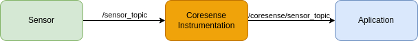
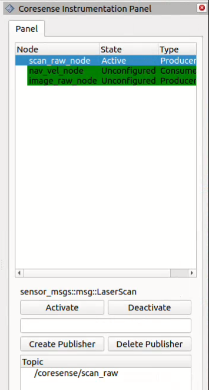

.. _instrumentation:

CoreSense Instrumentation
*************************

.. attention:: This package is part of the CORESENSE prject. And is still under development. any feedback is welcome.

Monitoring robot behavior in real-world applications often requires tracking multiple nodes, each with its own topics. To simplify this, we developed CoreSense Instrumentation. It allows you to monitor the state of the robot’s systems and manage nodes and topics, including creating or deleting them as needed.

.. _instrumentation_1:

   Virtual driver creation

The tool works by creating a virtual driver for each component, as shown in :numref:`instrumentation_1`. Each driver uses a lifecycle topic, letting you configure, activate, and deactivate components easily. You can also set up new data flows, enabling inspection and diagnostics of your robot’s status. For easy visualization, we provide an Rviz plugin, seen in :numref:`instrumentation_2`.

.. _instrumentation_2:

   Coresense Instrumentation Rviz plugin

----------------
How to use
----------------
Installation
=======================

To install CoreSense Instrumentation, follow these steps:

.. code-block:: bash

   mkdir ~/instrumentation/src -p 
   cd ~/instrumentation/src
   git clone https://github.com/CoreSenseEU/coresense_instrumentation.git
   cd .. 
   rosdep install -y -r -q --from-paths src --ignore-src
   colcon build --symlink-install

Deployment
=======================

Coresense instrumentation can be defined within a launch file to facilitate seamless interaction between various nodes. When configuring a virtual driver, the following parameters can be specified:

- **Name (optional)**: The name of the new topic to be created by the virtual driver.
- **Source Topics**: The names of the topics from which data will be taken.
- **Message Type**: The type of the ROS message (msg) that will be transmitted or received.
- **Node Type**: Indicates whether the node will act as a producer (publisher) or a consumer (subscriber) of the data.

.. code-block:: python
   
   def generate_launch_description():

    names = ['scan_raw',
             'nav_vel',
             'image_raw']

    topics = ['/scan_raw',
              '/nav_vel',
              '/head_front_camera/rgb/image_raw']

    msgs = ['sensor_msgs::msg::LaserScan',
            'geometry_msgs::msg::Twist',
            'sensor_msgs::msg::Image']

    node_types = ['Producer',
                  'Consumer',
                  'Producer']

    ns = ''

    composable_nodes = []
    for topic, msg, name, node_type in zip(topics, msgs, names, node_types):
        composable_node = ComposableNode(
            package='coresense_instrumentation_driver',
            plugin='coresense_instrumentation_driver::Instrumentation'
                    + node_type + '<' + msg + '>',
            name=name + '_node',
            namespace=ns,
            parameters=[{'topic': topic,
                         'topic_type': msg,
                         'type': node_type}],
        )
        composable_nodes.append(composable_node)

    container = ComposableNodeContainer(
        name='coresense_container',
        namespace=ns,
        package='rclcpp_components',
        executable='component_container',
        composable_node_descriptions=composable_nodes,
        output='screen',
    )

In this example, the instrumentation node is set to publish data to the new topic ``/head_front_camera/rgb/image_raw'``, using data sourced from ``/image_raw``,  with the message type ``sensor_msgs::msg::Image``.

----------------
Implementation
----------------

InstrumentationConsumer
=======================

Member Functions
----------------

- **get_topic**: Returns the name of the current topic.
- **get_topic_type**: Returns the type of the topic.
- **on_configure**: Configures the node during the transition to the active state.
- **on_activate**: Activates the node and makes it start its publishing/subscribing.
- **on_deactivate**: Deactivates the node and stops it from interacting with topics.
- **on_cleanup**: Cleans up the node resources.
- **on_shutdown**: Handles shutdown-related procedures.
  
Services
--------

- **handleCreateSubscriberRequest**: Handles the creation of new subscribers.
- **handleDeleteSubscriberRequest**: Handles the deletion of existing subscribers.

Private Members
---------------

- **pub_**: Publisher for the topic.
- **status_pub_**: Publisher for the node status information.
- **status_timer_**: Timer used to publish the node status periodically.
- **create_subscriber_service_**: Service to handle the creation of subscribers.
- **delete_subscriber_service_**: Service to handle the deletion of subscribers.
- **subscriptions_**: A map that stores active subscriptions based on topic names.
- **topic_**: The name of the topic.
- **topic_type_**: The type of the topic message.
- **type_**: Specifies whether the node is a producer or consumer.

InstrumentationProducer
=======================

Member Functions
----------------

- **get_topic**: Returns the topic name.
- **get_topic_type**: Returns the type of the topic message.
- **on_configure**: Called when the node enters the configure state.
- **on_activate**: Called when the node becomes active.
- **on_deactivate**: Called when the node is deactivated.
- **on_cleanup**: Called when cleaning up node resources.
- **on_shutdown**: Called when the node is shutting down.

Services
--------

- **handleCreatePublisherRequest**: Handles requests to create new publishers.
- **handleDeletePublisherRequest**: Handles requests to delete existing publishers.
  
Private Members
---------------

- **sub_**: Subscription to the topic.
- **status_pub_**: Publishes node status.
- **status_timer_**: Timer used to publish node status periodically.
- **create_publisher_service_**: Service for handling publisher creation.
- **delete_publisher_service_**: Service for handling publisher deletion.
- **publishers_**: Map of topic names to their respective publishers.
- **topic_**: Topic name.
- **topic_type_**: Message type for the topic.
- **type_**: Type of node (producer).

----------------
Demo
----------------

.. raw:: html

    <video width="640" height="360" controls>
        <source src="https://github.com/Juancams/coresense_instrumentation/assets/44479765/e6cada5c-5071-4a41-b226-5dc5c18a37aa" type="video/mp4">
        Your browser does not support the video tag.
    </video>

