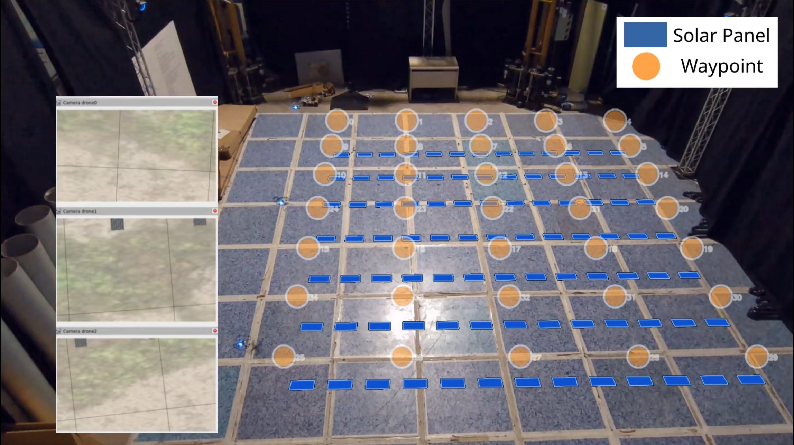

.. _inspection_testbeds:

TB2: Inspection Testbed
***********************

The inspection testbed validates the CoreSense collective awareness architecture with autonomous drone swarm photovoltaic panel inspection. It has been developed by UPM and evaluates collective resilience: how the swarm maintains coverage when a drone fails mid-mission or a panel anomaly triggers a re-inspection.

   Real flight with panel markers overlaid: orange circles are inspection waypoints, blue rectangles are solar panels. The left column shows simultaneous camera feeds from each of the three drones.

The main demonstrator is a multi-drone coverage mission over a solar panel array. Drones divide the inspection area through an auction-based task allocation, fly the assigned coverage lanes, and autonomously reassign stranded waypoints if a peer fails. The simulation runs entirely inside the Aerostack2 multirotor simulator — no external physics engine is required. See :ref:`tutorial_tb2_simulation` for a step-by-step guide.

Software used in this testbed:

- `aerostack2 <https://github.com/aerostack2/aerostack2>`_: ROS 2 framework for autonomous aerial systems, used as the runtime platform. See `Aerostack2 documentation <https://aerostack2.github.io>`_.
- `collective_awareness_structure <https://github.com/CoreSenseEU/collective_awareness_structure>`_: per-drone knowledge base, auction-based task allocation and collision avoidance.
- `knowledge_core <https://github.com/CoreSenseEU/knowledge_core>`_: RDFlib-backed minimalistic knowledge base with ROS 2 API, OWL2 reasoning and event subscriptions.
- `kb_msgs <https://github.com/pal-robotics/kb_msgs>`_: ROS 2 message definitions for the knowledge base API.
- `tb2_project <https://github.com/CoreSenseEU/tb2_project>`_: simulation environment, mission tooling and experiment runner for the inspection testbed.

The testbed is described in the public deliverables D7.4 Inspection Testbed Implementation and D7.5 Collective Resilience Evaluation.
