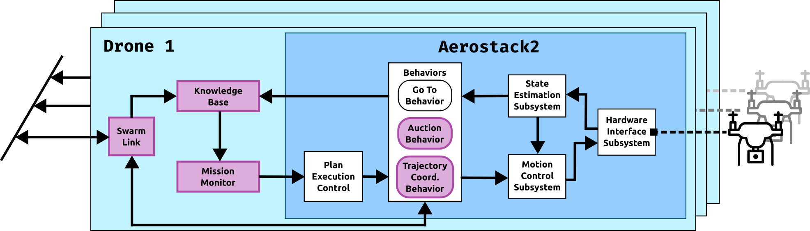

.. _tutorial_tb2_simulation:

Drone inspection missions in simulation
***************************************

This tutorial runs a photovoltaic panel inspection mission in the Gazebo simulation of the inspection testbed (TB2). It covers configuring the drone world, creating a mission with the built-in TUI, running it, and visualising the panels in RViz.

Requirements
============

- Aerostack2 and the TB2 project installed (see :ref:`inspection_testbeds`).
- ``tmuxinator`` installed (``gem install tmuxinator`` or ``apt install tmuxinator``).
- All commands run from the project root (``TB2_Panel_Inspection_Simulation/``).

   Per-drone Aerostack2 node stack: Knowledge Base and Mission Monitor (collective awareness, pink) alongside the core motion behaviors and hardware interface.

Configure the world
===================

The world YAML defines the GPS origin and the initial position of each drone in the simulation. The launcher reads drone namespaces directly from this file, so adding or removing a drone here is enough to change the swarm size.

The default single-drone world is ``config/world.yaml``:

.. code-block:: yaml

   /**:
     platform:
       ros__parameters:
         gps_origin:
           latitude: 40.4405287
           longitude: -3.6898277
           altitude: 100.0

   drone0:
     platform:
       ros__parameters:
         vehicle_initial_pose:
           x: -2.0
           y: -4.0
           z: 0.0

To add a second drone, append a new entry following the same pattern, then pass the file with ``-w``:

.. code-block:: yaml

   drone1:
     platform:
       ros__parameters:
         vehicle_initial_pose:
           x: 2.0
           y: -4.0
           z: 0.0

Pre-built world files for 3, 4 and 5 drones are in ``config/`` (e.g. ``config/world_swarm.yaml``, ``config/world4drones_solar.yaml``).

Create a mission with the TUI
==============================

The TUI is the recommended way to create mission files. Launch it from the project root:

.. code-block:: bash

   python3 tui_experiments.py

The TUI opens on the **Spec Generator** screen. Use the **Experiment Runner** tab (``Tab`` key) to execute batches of pre-built missions; this tutorial focuses on the generator.

**Steps to create a mission:**

1. Press **Add [a]** to open the spec editor form.

2. Fill in the basic parameters:

   - **Run name** — used as the filename prefix for the generated files.
   - **Arena bounds** — the ``[x_min, x_max] × [y_min, y_max]`` extent of the Gazebo world in metres.
   - **Drones — count** — number of drones; must match the entries in your world YAML.
   - **Drone start X** — the X coordinate where drones are placed in a line at startup.

3. Configure the inspection areas. Choose a layout (``grid_areas`` for a regular grid, ``strip_areas`` for horizontal bands, or ``custom`` to draw polygons interactively). For ``custom``, a matplotlib canvas opens:

   - **Left-click** — add a vertex to the current polygon.
   - **Right-click** or **n** — close the current polygon and start a new one.
   - **u** — undo the last vertex.
   - **Delete / Backspace** — discard the current in-progress polygon.
   - **Close window** — confirm and return to the form.

4. Set the coverage parameters under **World**:

   - ``street_spacing`` — distance between adjacent coverage lanes (metres).
   - ``wp_space`` — distance between waypoints along each lane (metres).
   - ``height`` — inspection flight height (metres).
   - ``speed`` — coverage flight speed (m/s).
   - ``orientation`` — sweep direction in degrees (0° = along X, 90° = along Y).

5. Press **Generate [g]** to write the mission files without launching, or **Generate & Run [r]** to generate and immediately start the stack and mission.

The generator writes:

- ``config/exp_config/<name>/<name>.yaml`` — world file with drone initial positions.
- ``missions/<name>/<name>_count<N>.yaml`` — mission file for ``N`` drones.

Launch the simulation
=====================

1. Start the Aerostack2 stack, passing the world file that matches your drone count:

   .. code-block:: bash

      ./launch_as2.bash -w config/exp_config/<name>/<name>.yaml

2. In a second terminal, open the ground station (RViz + monitoring):

   .. code-block:: bash

      ./launch_ground_station.bash -w config/exp_config/<name>/<name>.yaml

Run the mission
===============

Send the generated mission file to the running stack:

.. code-block:: bash

   python3 send_mission.py missions/<name>/<name>_count<N>.yaml -s

The ``-s`` flag enables simulation time. ``drone0`` acts as auctioneer: it plans the coverage waypoints for all areas, runs an auction with the collective awareness structure, and each drone executes the waypoints assigned to it.

Add ``-v`` for verbose output showing waypoint assignments and auction results.

View panels in RViz
====================

When ``send_mission.py`` starts, it publishes the inspection panel meshes and the ground plane to RViz automatically. Two ``MarkerArray`` topics become active:

- ``/solar_panels`` — one mesh marker per inspection panel.
- ``/ground_plane`` — the ground surface mesh.

These are displayed automatically if the ground station RViz config includes MarkerArray displays for those topics. To add them manually in RViz, click **Add → By topic → /solar_panels → MarkerArray** (and repeat for ``/ground_plane``).

To publish the panel markers standalone — for example when replaying a rosbag without a live mission — edit the mission path in ``publish_static_markers.py`` and run:

.. code-block:: bash

   python3 publish_static_markers.py

Stop the simulation
===================

.. code-block:: bash

   ./stop.bash
